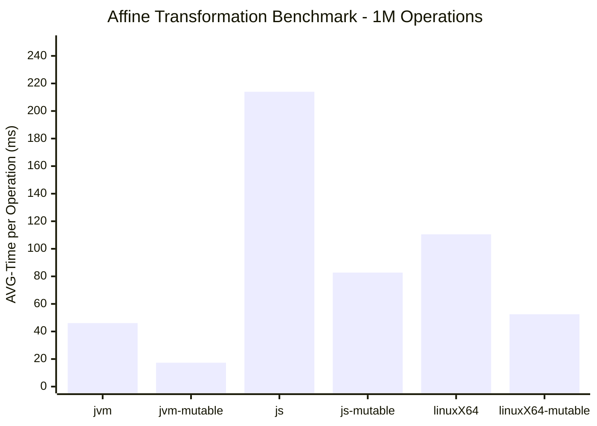

# Affine Transformation Benchmark

The benchmark evaluates the performance of affine transformation operations on 3D vectors, comparing immutable (`Vec3`)
and mutable (`MutableVec3`) implementations across different platforms (JVM, JS, and LinuxX64).

## Benchmark Description

This benchmark applies an affine transformation to lists of 3D vectors and measures the time taken to transform
all vectors and compute their sum. The transformation consists of: scaling, rotation, and translation.

The benchmark tests two approaches:

- **Immutable Transformation**: Uses `Vec3` (immutable vectors) which create new instances for each operation
- **Mutable Transformation**: Uses `MutableVec3` which modifies vectors in-place, reducing allocations

Each benchmark runs with three different vector counts: 10,000, 100,000, and 1,000,000 operations.

## Setup

### Benchmark Configuration

- **Mode**: Average Time (measures average execution time per operation)
- **Warmup**: 10 iterations × 500ms (to allow JIT compilation and optimize code paths)
- **Measurement**: 10 iterations × 5 seconds (for statistically significant results)
- **Operation Counts**: 10,000 / 100,000 / 1,000,000 vectors

### Dependency Versions

- Java 21
- Kotlin / KMP 2.2

### Machine Specifications

- Fedora 43 Workstation Edition
- Intel® Core™ i7-9750H × 12
- 16.0 GB RAM

## Results

The benchmark results demonstrate significant performance advantages when using mutable vectors for affine
transformations across all platforms. As shown in the chart below, mutable implementations consistently outperform their
immutable counterparts at the 1M operations scale:

The table illustrates that speedup increases with operation count across all platforms, suggesting that mutable
implementations become increasingly beneficial as the workload scales. At 1M operations, JVM achieves the highest
speedup (2.66x), followed by JS (2.59x) and LinuxX64 (2.10x). The performance gain is attributed to reduced object
allocations and lower garbage collection overhead in mutable implementations.

| Implementation   | Speedup 10K | Speedup  100K | Speedup 1M |
|------------------|-------------|---------------|------------|
| jvm-mutable      | 1.75x       | 2.23x         | 2.66x      |
| js-mutable       | 1.19x       | 2.57x         | 2.59x      |
| linuxX64-mutable | 1.39x       | 1.72x         | 2.10x      |

*Speedup factor: immutable time / mutable time. Higher values indicate better mutable performance.*

For performance-critical applications involving large-scale vector transformations, the mutable API provides substantial
benefits while maintaining the same transformation semantics.

## Appendix: Benchmark Data

| Platform | Transformation | Count     | Mode | Cnt | Score (ms/op) | Error (±) |
|----------|----------------|-----------|------|-----|---------------|-----------|
| JVM      | Immutable      | 10,000    | avgt | 10  | 0.163         | 0.003     |
| JVM      | Immutable      | 100,000   | avgt | 10  | 1.947         | 0.014     |
| JVM      | Immutable      | 1,000,000 | avgt | 10  | 46.081        | 1.202     |
| JVM      | Mutable        | 10,000    | avgt | 10  | 0.093         | 0.002     |
| JVM      | Mutable        | 100,000   | avgt | 10  | 0.873         | 0.013     |
| JVM      | Mutable        | 1,000,000 | avgt | 10  | 17.318        | 1.588     |
| JS       | Immutable      | 10,000    | avgt | 10  | 0.643         | 0.027     |
| JS       | Immutable      | 100,000   | avgt | 10  | 17.657        | 0.316     |
| JS       | Immutable      | 1,000,000 | avgt | 10  | 213.981       | 3.269     |
| JS       | Mutable        | 10,000    | avgt | 10  | 0.541         | 0.004     |
| JS       | Mutable        | 100,000   | avgt | 10  | 6.872         | 0.054     |
| JS       | Mutable        | 1,000,000 | avgt | 10  | 82.758        | 1.566     |
| LinuxX64 | Immutable      | 10,000    | avgt | 10  | 0.665         | 0.005     |
| LinuxX64 | Immutable      | 100,000   | avgt | 10  | 8.853         | 0.037     |
| LinuxX64 | Immutable      | 1,000,000 | avgt | 10  | 110.505       | 9.807     |
| LinuxX64 | Mutable        | 10,000    | avgt | 10  | 0.479         | 0.002     |
| LinuxX64 | Mutable        | 100,000   | avgt | 10  | 5.157         | 0.007     |
| LinuxX64 | Mutable        | 1,000,000 | avgt | 10  | 52.539        | 0.255     |
