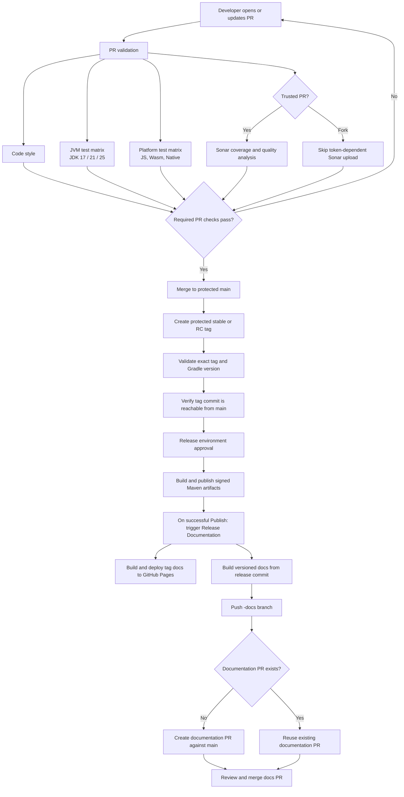

# CI/CD development cycle

This document describes the validation, release, and documentation workflows used by the project.

After Maven publication succeeds, `Release Documentation` runs automatically. Its Pages deployment and versioned documentation PR are independent jobs: a failure in either does not require republishing Maven artifacts. Review and merge the `<tag>-docs` PR. If documentation fails, rerun failed jobs in Actions or manually run **Release Documentation** with the published release tag; do not rerun **Publish** to recover documentation. A manual run redeploys that tag as the site's current version, so use the latest intended release tag when retrying Pages. The repository needs GitHub Pages configured to publish via Actions, the `documentation` label, and permission for Actions to create pull requests.
