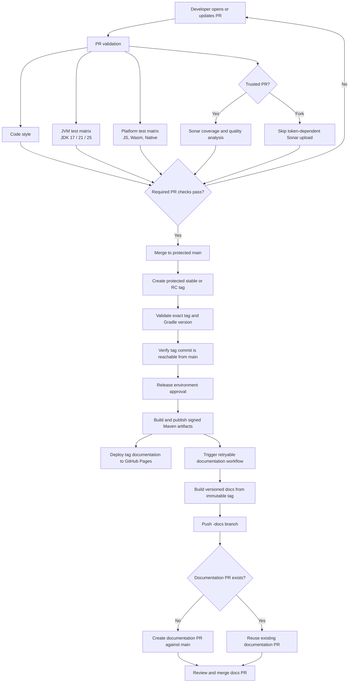

# CI/CD development cycle

This document describes the validation, release, and documentation workflows used by the project.

The Pages deployment and documentation PR workflow are independent after Maven publication, so documentation can be retried without republishing artifacts.
